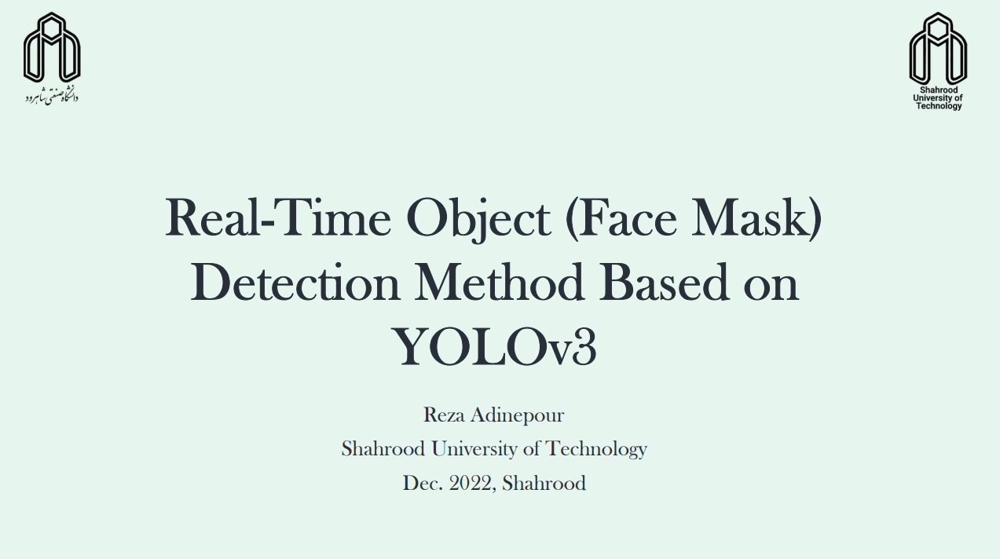

# **Real-Time Object Detection Using YoLo Network**
## In this project I implemented a real time object detection algorithm using **YOLO** network

This project is part of my [presentation]() in the Neural Networks course at [Shahrood University of Technology](https://shahroodut.ac.ir/en/)
