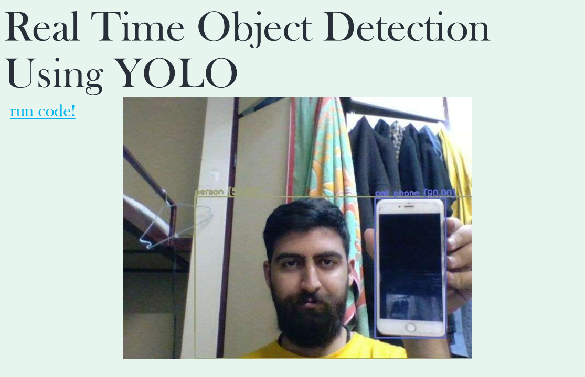
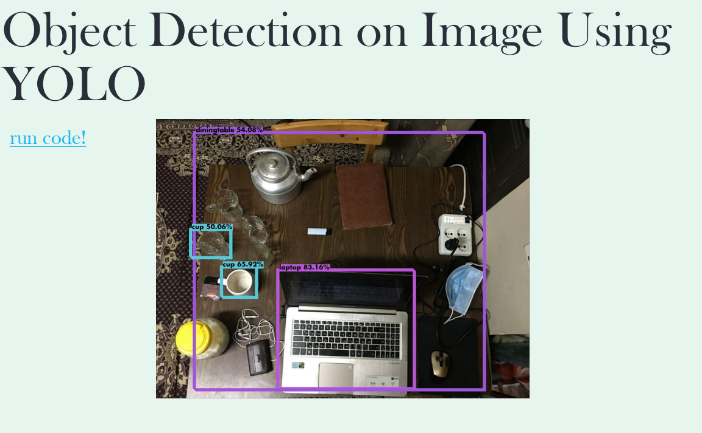

# **Real-Time Object Detection Using YoLo Network**
## In this project I implemented a real time object detection algorithm using **YOLO** network

This project is part of my [presentation](https://github.com/rezaAdinepour/Real-Time-Object-Detection-Using-YoLoV4-Network/blob/main/YOLO-Presentation.pdf) in the Neural Networks course at [Shahrood University of Technology](https://shahroodut.ac.ir/en/)

# You can use this project in two ways
1. Real-Time
2. Offline

# Example for Real-Time method

# Example for offline method

You can read file of this presentation [here](https://github.com/rezaAdinepour/Real-Time-Object-Detection-Using-YoLoV4-Network/blob/main/YOLO-Presentation.pdf)
